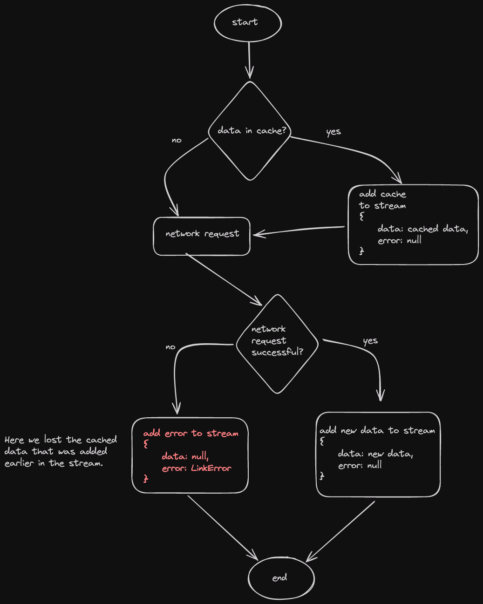

# graphql_caching

A Flutter project showcasing GraphQL Caching and Offline First approach using Ferry.

## What is working?

- Caching
- Optimistic mutation
- Customizing field merge behavious (necessary for pagination).
- Infinite scroll view (no error, last page implemetation)

## Complexity

High

## Considiration

App gets data from cache if available then does network request. If new data is available from network updates the cache and UI. It is not possible without `Stream`.

## Implementation

Read official documentation: [Official Ferry Documentation](https://ferrygraphql.com/docs/)

### Set fetch policy:

```
Client(
  ...
  defaultFetchPolicies: {
    OperationType.query: FetchPolicy.CacheAndNetwork,
  },
)
```

### Cache latest valid data

When using `FetchPolicy.CacheAndNetwork` we get data from cache, then does network call and get data from network. By default when network request fails ferry returns `null` data and we will loose the data from the cache. So we might need a workaround to get the cached data that was returned earlier. So that our flow will be like `cached data` > `newtwork request fails` > `cached data with error`.



Here is how we can cache.

```dart
ResultStream<T> queryStream<T, TData, TVars>({
  required OperationRequest<TData, TVars> request,
  required T Function(TData? data) mapper,
  NextTypedLink<TData, TVars>? forward,
}) {
  /// Cached TData that was not null at a point.
  /// If ferry gives a valid data from cache, then subsequent request returns
  /// error data will be lost. It will preserve the old valid data if there
  /// were any before the error.
  TData? cacheData;

  return Client().request(request, forward).transform(
        StreamTransformer<OperationResponse<TData, TVars>,
            Result<T>>.fromHandlers(
          handleDone: (sink) {
            sink.close();
          },
          handleData: (data, sink) {
            if (data.data != null) cacheData = data.data;
            sink.add(
              _mapResult(
                value: data,
                mapper: mapper,
                previousData: cacheData,
              ),
            );
          },
        ),
      );
}
```

### Error handling
```dart
Result<T> _mapResult<T, TData, TVars>({
  required OperationResponse<TData, TVars> value,
  required T Function(TData? data) mapper,
  TData? previousData,
}) {
  GqlError? error;

  if (value.hasErrors) {
    if (value.graphqlErrors?.isNotEmpty ?? false) {
      error = ServerError();
    } else if (value.linkException != null) {
      error = LinkError();
    }
  }
  return Result(
    data: mapper.call(value.data ?? previousData),
    dataSource: switch (value.dataSource) {
      tl.DataSource.None => DataSource.none,
      tl.DataSource.Link => DataSource.link,
      tl.DataSource.Cache => DataSource.cache,
      tl.DataSource.Optimistic => DataSource.optimistic,
    },
    error: error,
  );
}
```

### Type policy to merge paginated data
Type policy can be tricky and hard to implement since it is not typed. Type policy depends on how you query the data.

For example if you have query like this,

```graphql
# import '../fragment/post_fragment.graphql'
query Posts($options: PageQueryOptions) {
  posts(options: $options) {
    data {
      ...PostFragment
    }
  }
}
```

Then type policy will look like this. You can see how query `posts` is matched with field key in type policy.
The `merge` function provides `existing` (stored in cache) and `incoming` (new data). You have to write
your logic to merge them and return the same type as `existing` or `incoming`. In this case it is `Map<String, dynamic>`.
If you try to add type in the `FieldPolicy` is won't work as ferry internally uses recursive generic function to
denormalize the data.

```dart
final typePolicies = {
  'Query': TypePolicy(
    fields: {
      'posts': FieldPolicy(
        keyArgs: const [],
        merge: (existing, incoming, _) {
          final merged = LinkedHashSet<dynamic>(
            equals: jsonMapEquals,
            hashCode: const DeepCollectionEquality().hash,
          )
            ..addAll((existing?['data'] as Iterable?) ?? [])
            ..addAll((incoming?['data'] as Iterable?) ?? []);
          return incoming?..['data'] = merged.toList();
        },
      ),
    },
  ),
};
```

Check the code along with official documentation to get more understanding as this doc only covers things that are not available in the official documentation.